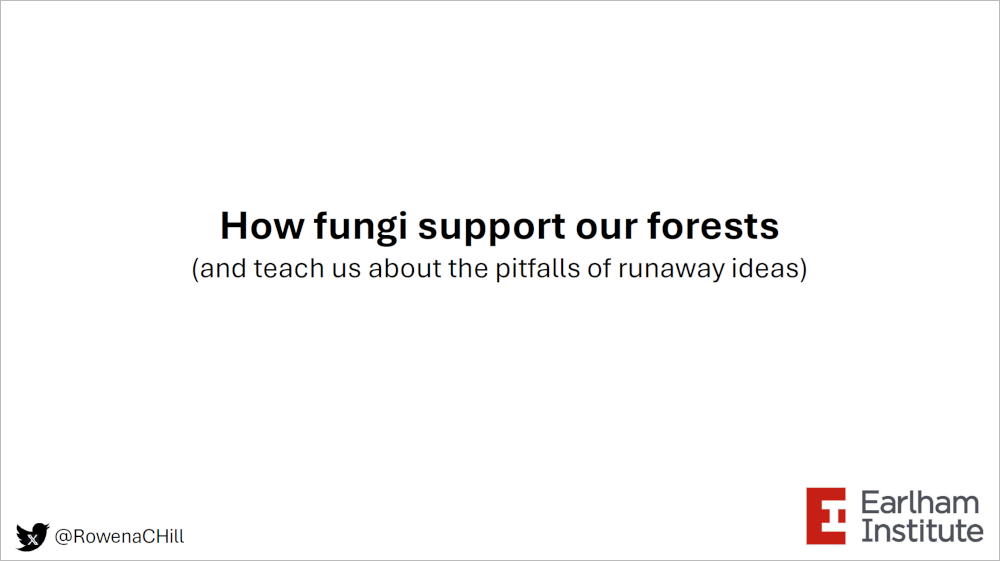

# How fungi support our forests (and teach us about the pitfalls of runaway ideas) #

A talk given on 7th October 2024 at the Norwich Biosciences Institutes Accessible Science Talks, summarising the current debate in the fungal research community about mycorrhizal fungi and the 'wood wide web'.

[Slides including gifs and animation](https://github.com/Rowena-h/Presentations/blob/master/How%20fungi%20support%20our%20forests%20(and%20teach%20us%20about%20the%20pitfalls%20of%20runaway%20ideas)/How%20fungi%20support%20our%20forests%20-%20NBI%20accessible%20talks%202024.pptx)

[Static slides](https://github.com/Rowena-h/Presentations/blob/master/How%20fungi%20support%20our%20forests%20(and%20teach%20us%20about%20the%20pitfalls%20of%20runaway%20ideas)/How%20fungi%20support%20our%20forests%20static%20-%20NBI%20accessible%20talks%202024.pdf)
