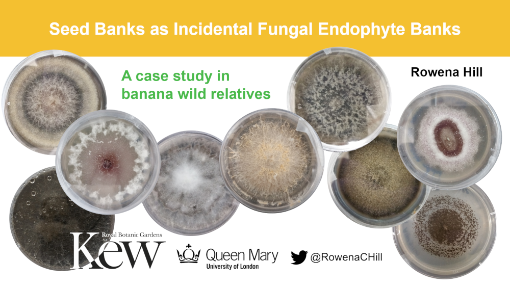

# Seed Banks as Incidental Fungal Endophyte Banks #

A presentation given on 10th May 2021 at the weekly **K**ew **A**dvances in **B**otany **a**nd **M**ycology seminar, summarising the results of our study [Hill et al. (2021) Seed Banks as Incidental Fungi Banks: Fungal Endophyte Diversity in Stored Seeds of Banana Wild Relatives. Front. Microbiol. 12:643731. doi: 10.3389/fmicb.2021.643731](https://www.frontiersin.org/articles/10.3389/fmicb.2021.643731/full).

Scripts for the various data visualisations shown in the slides are linked below:
* [Fungal diversity knowledge gap and endophyte lifestyle overlaps](https://github.com/Rowena-h/Presentations/blob/master/Seed%20Banks%20as%20Incidental%20Fungal%20Endophyte%20Banks/Data%20and%20scripts/KABaM_figures.r)
* [Gap analysis of Ascomycota genome data](https://github.com/Rowena-h/AscomycotaGapAnalysis)
* [Fungal endophytes in stored wild banana seeds](https://github.com/Rowena-h/MusaEndophytes).

