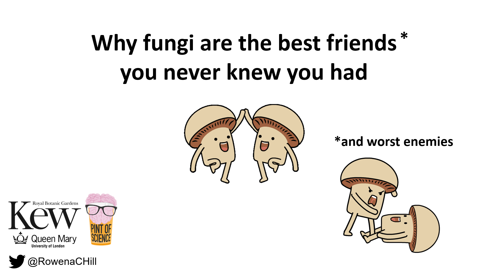

# Why fungi are the best friends (and worst enemies) you never knew you had #

A talk given on 11th May 2022 at the 'Unloved Animals Club: Battle of the Kingdoms' event of the [Pint of Science](https://pintofscience.co.uk/) Festival 2022.

[Slides including gifs and animation](https://github.com/Rowena-h/Presentations/blob/master/Why%20fungi%20are%20the%20best%20friends%20(and%20worst%20enemies)%20you%20never%20knew%20you%20had/Why%20fungi%20are%20the%20best%20friends%20(and%20worst%20enemies)%20you%20never%20knew%20you%20had%20-%20Pint%20of%20Science%202022.pptx)

[Static slides](https://github.com/Rowena-h/Presentations/blob/master/Why%20fungi%20are%20the%20best%20friends%20(and%20worst%20enemies)%20you%20never%20knew%20you%20had/Why%20fungi%20are%20the%20best%20friends%20(and%20worst%20enemies)%20you%20never%20knew%20you%20had%20static%20-%20Pint%20of%20Science%202022.pdf)
